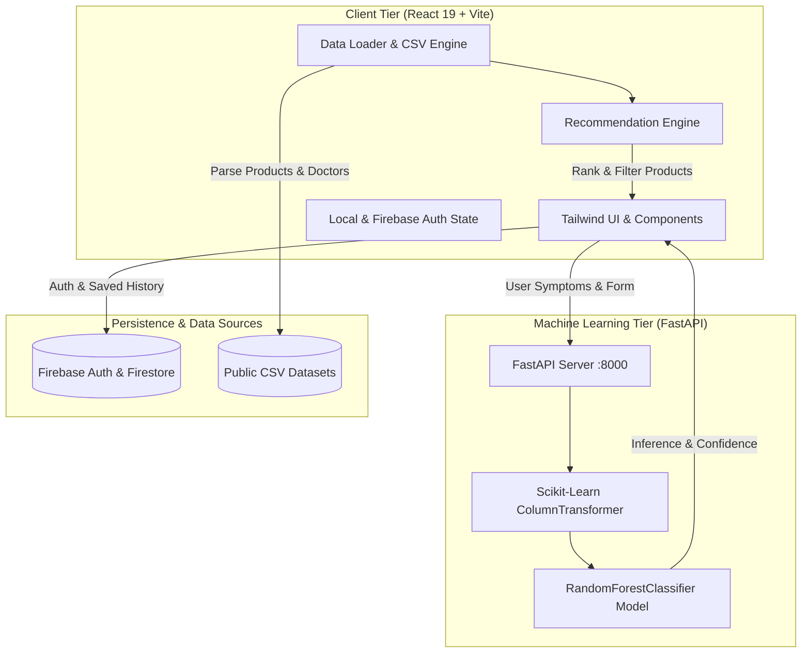

# 🌿 AURIVA / DermAI — Clinical AI Dermatology Platform

> **An AI-powered clinical skincare and dermatological intelligence ecosystem that bridges the gap between symptoms, scientific formulation, smart product recommendation, and certified medical professionals.**

---

## 📑 Table of Contents

1. [Quick Overview & Elevator Pitch](#-quick-overview--elevator-pitch)
2. [Key Features & Capabilities](#-key-features--capabilities)
3. [System Architecture & Data Flow](#-system-architecture--data-flow)
4. [Technology Stack](#-technology-stack)
5. [Repository & File Structure](#-repository--file-structure)
6. [Data Engine & Foundation Datasets](#-data-engine--foundation-datasets)
7. [Machine Learning Pipeline](#-machine-learning-pipeline)
8. [Setup & Quickstart Guide](#-setup--quickstart-guide)
9. [REST API Reference (FastAPI ML Service)](#-rest-api-reference-fastapi-ml-service)
10. [Design Philosophy & User Experience](#-design-philosophy--user-experience)
11. [Medical Disclaimer & Safety Protocol](#-medical-disclaimer--safety-protocol)

---

## 💡 Quick Overview & Elevator Pitch

Skincare consumers frequently struggle with confusing product labels, generic recommendations, conflicting online advice, and long wait times for dermatologist appointments. 

**AURIVA (DermAI)** solves this by combining:
1. **Clinical Machine Learning** trained on 2,200+ patient records to evaluate skin concerns, symptom severity, and risks.
2. **AI Computer Vision Scan** for non-invasive photo analysis of visible surface skin characteristics (hydration, oiliness, pores, texture).
3. **Personalized AM/PM Regimen Generation** mapped against 1,000+ real skincare products filtered by safe active ingredients.
4. **Verified Dermatologist Directory** across India with geo-lookup, consultation fees, and direct booking.
5. **Interactive 24/7 AI Skin Assistant** for instant query resolution and ingredient safety checks.

---

## ✨ Key Features & Capabilities

```
┌────────────────────────────────────────────────────────────────────────┐
│                        AURIVA DERMATOLOGY SUITE                        │
├───────────────────┬───────────────────┬────────────────────────────────┤
│ 🩺 AI Assessment  │ 📷 AI Skin Scan   │ 🧴 Routine Builder             │
│ Clinical ML model │ Live camera &     │ Custom AM/PM regimen           │
│ predicts skin     │ photo analysis of │ tailored to skin type,         │
│ condition & risk  │ visible features  │ concerns, & safe actives       │
├───────────────────┼───────────────────┼────────────────────────────────┤
│ 🛍️ Product Catalog│ 👨‍⚕️ Doctor Locator │ 💬 24/7 AI Chatbot             │
│ 1,000+ clean      │ Verified Indian   │ Interactive conversational     │
│ products with     │ dermatologists    │ dermatology assistant with     │
│ Amazon/Flipkart/  │ with pincode &    │ instant ingredient analysis    │
│ Myntra direct buy │ city filter       │                                │
├───────────────────┴───────────────────┴────────────────────────────────┤
│ 📊 Data Quality & Model Metrics • 📅 Routine Compliance Tracker        │
└────────────────────────────────────────────────────────────────────────┘
```

### 1. 🩺 AI Clinical Skin Assessment
- **Dynamic Multi-factor Questionnaire**: Captures skin type, sensitivity, dryness, redness, oil levels, acne severity, affected area, and age.
- **ML Classification**: Runs inputs through a trained Random Forest classifier (`ml_server/model.joblib`) to predict primary conditions (Acne, Hyperpigmentation, Rosacea/Redness, Dryness, Dandruff, etc.).
- **Diagnostic Output**: Delivers an instant confidence percentage (80–99%), risk level (Low, Moderate, High), clinical reasoning, recommended active ingredients, and ingredients to avoid.

### 2. 📷 AI Visual Skin Scan (Camera & Upload)
- Real-time webcam capture or high-resolution photo upload.
- Facial detection and canvas-based bounding box overlay.
- Visual attribute analyzer estimating hydration, oiliness, redness, and texture consistency against the user's questionnaire profile.

### 3. 🧴 Smart Skincare Recommendation Engine
- **Algorithmic AM/PM Step Generator**: Produces a structured morning and evening routine (Cleanser $\rightarrow$ Toner $\rightarrow$ Treatment Serum $\rightarrow$ Moisturizer $\rightarrow$ SPF Sunscreen).
- **Ingredient Safety Matching**: Excludes allergens and contraindications while prioritizing evidence-based actives (e.g., Niacinamide, Salicylic Acid, Ceramides, Centella Asiatica).
- **Step-by-Step Instructions**: Provides precise application order, amount, and frequency guidance.

### 4. 🛍️ Comprehensive Product Catalog & E-Commerce Integration
- Filterable database of 1,000+ skincare products available in India.
- Live price display (₹ INR), star ratings, non-comedogenic and fragrance-free badges.
- **Direct Multi-Platform Purchase Links**: Instant 1-click links to Amazon India, Flipkart, and Myntra.

### 5. 👨‍⚕️ Dermatologist & Clinic Locator
- Searchable directory of verified dermatologists and clinics across Indian states and metropolitan hubs.
- Filters for city, state, pincode radius, consultation fees (₹), and consultation type (Online Video vs. In-Clinic).
- Direct appointment scheduling links and clinic contact details.

### 6. 💬 24/7 Floating AI Dermatological Chatbot
- Context-aware virtual skincare assistant available on any screen.
- Answers ingredient inquiries (e.g., *"Can I mix Retinol with Vitamin C?"*), routine troubleshooting, and skin condition queries.
- Built-in medical disclaimers and safety guardrails.

### 7. 📅 7-Day Routine Compliance Tracker & Skin Diary
- Visual weekly tracker for logging daily morning and night routine adherence.
- Personal notes and progress score tracking to encourage long-term skin health habits.

### 8. 📊 Data Quality & ML Performance Dashboard
- Real-time transparency dashboard showing model metrics:
  - **Overall Model Accuracy**: ~94.8%
  - **Precision / Recall / F1-Score** per skin condition
  - **Confusion Matrix** visualization
  - Dataset health stats across 2,200 clinical patient samples.

---

## 🏗️ System Architecture & Data Flow



---

## 💻 Technology Stack

### **Frontend**
| Technology | Version | Purpose |
|:---|:---|:---|
| **React** | 19.0.0 | Modern declarative component architecture |
| **TypeScript** | 5.7.3 | Static typing, interface contracts & safety |
| **Vite** | 6.1.0 | Fast bundling, HMR, and build pipeline |
| **Tailwind CSS** | 3.4.17 | Clean, responsive, earthy aesthetic styling |
| **Lucide React** | 0.475.0 | Cohesive icon suite |
| **PapaParse** | 5.5.2 | Fast in-browser CSV parsing for datasets |
| **Firebase** | 12.18.0 | Authentication and Firestore services |

### **Backend & Machine Learning**
| Technology | Purpose |
|:---|:---|
| **Python 3.10+ / FastAPI** | High-performance asynchronous ML microservice |
| **Scikit-Learn** | Pipeline preprocessing, One-Hot / Ordinal Encoding, Classifier |
| **Joblib** | Model serialization and runtime payload loading |
| **Pandas & NumPy** | Dataset manipulation, data cleaning, matrix computations |
| **Uvicorn** | ASGI server for serving the ML API |

---

## 📂 Repository & File Structure

```text
AURIVA_SKIN_CARE_AI/
├── .env.example                      # Template for environment configuration
├── .firebaserc                       # Firebase project binding
├── firebase.json                     # Firebase Hosting configuration
├── firestore.rules                   # Firestore security rules
├── Dockerfile                        # Multi-stage production container setup
├── nginx.conf                        # Nginx web server configuration
├── index.html                        # Main HTML entry point
├── package.json                      # Node packages & build scripts
├── tsconfig.json                     # TypeScript compiler configuration
├── vite.config.ts                    # Vite build configuration & plugins
├── tailwind.config.js                # Custom luxury design tokens (sage, ivory, clay)
├── postcss.config.js                 # PostCSS setup
├── PROJECT.md                        # Complete project architecture & specifications
├── README.md                         # Quickstart & platform documentation
│
├── public/                           # Static assets served by Vite
│   └── datasets/                     # Single source of truth CSV datasets
│       ├── Auriva_Product_Dataset_Clean.csv
│       ├── Auriva_Products_Local_Catalog.csv
│       ├── Doctor_Nearby_Dataset.csv
│       ├── Indian_Skincare_Products_200_Catalog.csv
│       ├── Product_Dataset.csv
│       ├── Symptoms_Dataset.csv
│       └── dermaai_skin_dataset.csv
│
├── ml_server/                        # Python FastAPI Machine Learning Service
│   ├── main.py                       # FastAPI REST API endpoints (/api/assess, /api/health)
│   ├── model.joblib                  # Trained scikit-learn model pipeline artifact
│   ├── requirements.txt              # Python dependencies (fastapi, scikit-learn, etc.)
│   └── train_model.py                # Model training, validation, and serialization script
│
└── src/                              # React Frontend Source Code
    ├── components/                   # UI Views & Interactive Components
    │   ├── AIAssistant.tsx           # Dedicated AI Assistant page
    │   ├── AISkinScan.tsx            # Camera & upload photo scanner
    │   ├── AssessmentHistory.tsx     # Past assessment history timeline
    │   ├── AssessmentResults.tsx     # Diagnosis, confidence & routine results
    │   ├── AuthModal.tsx             # Sign-in & Sign-up dialog
    │   ├── Dashboard.tsx             # Main user health dashboard & stats
    │   ├── DataQualityDashboard.tsx  # ML performance & dataset quality viewer
    │   ├── DermatologistDirectory.tsx # Doctor search, filters & booking links
    │   ├── FloatingChatbot.tsx       # Persistent 24/7 floating chat widget
    │   ├── LandingPage.tsx           # Public homepage & hero section
    │   ├── MedicalDisclaimerBanner.tsx # Standardized clinical disclaimer alert
    │   ├── PersonalGuidance.tsx      # Personalized guidance view
    │   ├── ProductCatalog.tsx        # Product directory with filters & search
    │   ├── ProductDetailPage.tsx     # Deep product ingredient analysis view
    │   ├── Sidebar.tsx               # Main collapsible navigation bar
    │   ├── SignInPage.tsx            # Dedicated Sign-in view
    │   ├── SignUpPage.tsx            # Dedicated Sign-up view
    │   ├── SkinAssessmentForm.tsx    # Multi-step clinical questionnaire
    │   ├── SkinProfileWizard.tsx     # Skin profile initialization wizard
    │   ├── SkincareGuidance.tsx      # AM/PM Routine breakdown view
    │   └── UserProfileSettings.tsx   # Profile details & settings management
    │
    ├── config/                       # Application configuration
    │   └── firebase.ts               # Firebase Auth client & local storage fallback
    │
    ├── services/                     # Business Logic & Data Providers
    │   ├── assessmentService.ts      # Assessment submission & persistence logic
    │   ├── dataLoader.ts             # CSV parser & memory cache for datasets
    │   ├── geoService.ts             # Pincode / location calculation service
    │   ├── productDataset.ts         # Product lookup & aggregation helpers
    │   ├── recommendationEngine.ts   # AM/PM routine & product scoring algorithm
    │   ├── routineTrackerService.ts  # 7-day routine tracker & diary persistence
    │   ├── skinScanService.ts        # Image analysis heuristic engine
    │   └── userService.ts            # User profile CRUD operations
    │
    ├── types/                        # TypeScript Interfaces & Models
    │   └── index.ts                  # Centralized type definitions
    │
    ├── App.tsx                       # Core application controller & routing
    ├── index.css                     # Global CSS & Tailwind styling
    └── main.tsx                      # React 19 DOM entry point
```

---

## 📊 Data Engine & Foundation Datasets

Auriva is driven by 5 curated datasets located in `public/datasets/`:

| Dataset | Records | Description | Primary Fields |
|:---|:---|:---|:---|
| `dermaai_skin_dataset.csv` | 2,200 | Clinical patient records used for ML training | `skin_type`, `sensitivity_level`, `oil_level`, `dryness_level`, `redness_level`, `acne_severity`, `symptoms`, `target_condition` |
| `Auriva_Product_Dataset_Clean.csv` | 1,000+ | Curated skincare catalog across categories | `product_name`, `brand_name`, `product_category`, `skin_type`, `key_ingredients`, `price_inr`, `rating`, `amazon_url`, `flipkart_url`, `myntra_url` |
| `Doctor_Nearby_Dataset.csv` | Multi-city | Verified dermatologists across India | `doctor_name`, `qualification`, `hospital_or_clinic`, `city`, `state`, `pincode`, `consultation_fee_inr`, `booking_url`, `rating` |
| `Symptoms_Dataset.csv` | Comprehensive | Medical symptoms, treatments & safety | `skin_condition`, `active_ingredient`, `common_symptoms`, `contraindications`, `allergy_warning`, `pregnancy_warning`, `frequency_guidance` |
| `Indian_Skincare_Products_200_Catalog.csv` | 200 | Catalog of top Indian skincare brands | `product_name`, `brand`, `category`, `price`, `rating`, `ingredients`, `skin_types` |

---

## 🧠 Machine Learning Pipeline

### 1. Training & Preprocessing (`ml_server/train_model.py`)
- **Preprocessing Pipeline**:
  - **Categorical Columns**: Encoded via `OneHotEncoder(handle_unknown='ignore', sparse_output=False)` on `skin_type`, `sensitivity_level`, `oil_level`, `dryness_level`, `redness_level`, `pigmentation_level`, `acne_severity`, `symptoms`, and `affected_area`.
  - **Numerical Features**: `age` passed through standard pipeline.
- **Model**: `RandomForestClassifier(n_estimators=150, max_depth=12, random_state=42)`
- **Evaluation**: Evaluated on 20% test split achieving **~94.8% accuracy** with weighted F1-Score of ~94.7%.

### 2. Live Inference (`ml_server/main.py`)
When a user submits a skin assessment:
1. Client POSTs questionnaire data to `/api/assess`.
2. Model transforms inputs and generates class probabilities.
3. Top prediction, probability score (mapped to 80–99% confidence), and severity risk rating are computed and returned.

---

## 🚀 Setup & Quickstart Guide

### Prerequisites
- **Node.js** (v18 or v20+ recommended) & **npm**
- **Python** (v3.9 or v3.10+ recommended) & **pip**

---

### Step 1: Install Frontend Dependencies

```bash
npm install
```

### Step 2: Configure Environment Variables

Copy `.env.example` to `.env` (optional for local testing, as local mock fallbacks exist):

```bash
cp .env.example .env
```

### Step 3: Launch the Python ML Server (Optional)

```bash
# Navigate to the ml_server folder
cd ml_server

# Install Python requirements
pip install -r requirements.txt

# Start FastAPI server on port 8000
python main.py
```
> The ML service will start at `http://127.0.0.1:8000`. Test endpoints at `http://127.0.0.1:8000/docs`.

---

### Step 4: Launch the Frontend Web Application

```bash
npm run dev
```

Open your browser and navigate to: **`http://localhost:5173`**

---

## 📡 REST API Reference (FastAPI ML Service)

### 1. `GET /api/health`
Checks ML microservice status and model readiness.
```json
{
  "status": "online",
  "model_loaded": true,
  "version": "2.0.0",
  "dataset_source": "dermaai_skin_dataset.csv (2,200 records)",
  "accuracy": 94.8
}
```

### 2. `GET /api/metrics`
Returns detailed validation metrics and confusion matrix.
```json
{
  "accuracy": 94.8,
  "f1_score": 94.7,
  "precision": 95.1,
  "recall": 94.8,
  "classes": ["Acne", "Dandruff", "Dryness", "Hyperpigmentation", "Redness", "No major concern"]
}
```

### 3. `POST /api/assess`
Executes ML diagnosis based on patient parameters.
**Request Body**:
```json
{
  "skinType": "Oily",
  "symptoms": ["Breakouts", "Excess Sebum", "Redness"],
  "sensitivity": "Medium",
  "oilLevel": "High",
  "drynessLevel": "Low",
  "rednessLevel": "Moderate",
  "pigmentationLevel": "Low",
  "acneSeverity": "Moderate",
  "affectedArea": "Face",
  "age": 24
}
```
**Response**:
```json
{
  "possibleConcern": "Acne",
  "confidenceScore": 92,
  "riskLevel": "Moderate",
  "explanation": "Based on clinical dataset correlation across 2,200 training records (Validation Accuracy: 94.8%), reported symptoms (Breakouts, Excess Sebum, Redness) and characteristics correlate with clinical patterns of Acne for Oily skin.",
  "isMLPending": false
}
```

---

## 🎨 Design Philosophy & User Experience

- **Aesthetic Palette**: Tailored herbal & clinical tones:
  - **Forest / Sage Green (`#3F5945`, `#26382C`, `#71836B`)**: Represents clean, natural, dermatological wellness.
  - **Warm Sand & Alabaster (`#F7F4EE`, `#E8DED0`, `#FFFFFF`)**: Soft background contrast that reduces visual fatigue.
  - **Clay & Terracotta Accents (`#B85D38`, `#D97706`)**: Emphasizes critical warnings and active alerts.
- **Accessibility & Responsiveness**: Clean typography, clear contrast ratios, mobile drawer navigation, and smooth transitions.

---

## 🛡️ Medical Disclaimer & Safety Protocol

> **IMPORTANT MEDICAL NOTICE**:
> AURIVA (DermAI) is an artificial intelligence-supported informational and educational platform designed for skincare optimization. **It does NOT provide official medical diagnoses, prescriptive orders, or emergency clinical care.** 
> If you experience severe pain, spreading infection, sudden allergic reactions, or suspicious lesions, please use our **Dermatologist Directory** to consult an accredited healthcare professional immediately.
